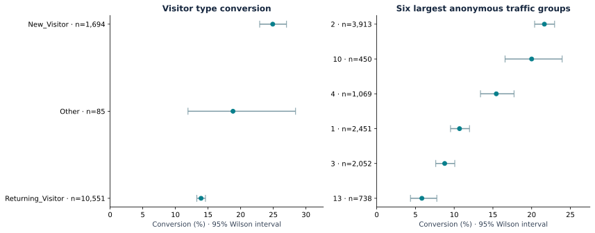

# Shopping Conversion

**Yang Nibei · Business Analytics Portfolio · 05 / 10**

> Which session segments show conversion gaps worth investigating?

[Portfolio](https://github.com/yangnibei) · [Results & decisions](REPORT.md) · [Python analysis](analysis.py)



## Business brief

This public-data case study explores a focused business question using **Wilson confidence intervals, visitor and traffic segmentation**. Read the results alongside their assumptions before acting on them.

## Approach

Wilson confidence intervals, visitor and traffic segmentation. The implementation contains input and reconciliation assertions. Each run writes an aggregate report, machine-readable metrics and the chart shown above.

## Reproduce

Python 3.11+ recommended. From this repository:

```bash
python -m venv .venv
source .venv/bin/activate
python -m pip install -r requirements.txt
python -m unittest -v
python analysis.py
```

On Windows, activate with `.venv\\Scripts\\activate`. Use `--data-dir /absolute/path/to/cache` and `--output-dir /absolute/path/to/results` to keep downloads and regenerated outputs elsewhere. The first public-data run requires internet access. Raw data stays in the ignored `data/` directory; it is not redistributed in this repository. Runs reuse cached archives and record their SHA-256 hashes in `results.json`.

## Data & attribution

UCI Machine Learning Repository, dataset key `shoppers`; exact citation, download URL, licence and source hash are recorded in [results.json](results.json) after execution. Original data is CC BY 4.0; attribution is preserved. See `SOURCES` in [utils.py](utils.py). These are historical teaching datasets, not current business measurements.

## Limitations

Sessions are observational, not a randomised funnel experiment. PageValues is excluded to avoid outcome-linked reasoning.

This repository is an educational portfolio case study, not paid client work, employment evidence or a production system. Code and documentation were developed with AI assistance and executed against the stated data; that does not imply independent third-party validation.

## Repository guide

- `analysis.py`: project-specific calculations and checks.
- `utils.py`: download, provenance and reporting helpers.
- `test_analysis.py`: offline helper unit tests.
- `REPORT.md`: generated findings and decision boundaries.
- `results.json`: aggregate metrics and source provenance.
- `analysis.svg`: reproducible figure.

